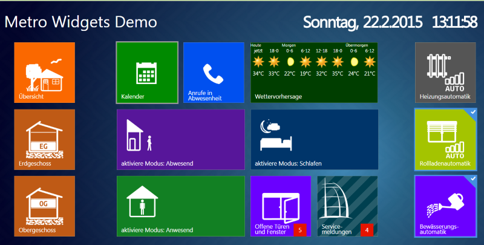

ioBroker.vis-animationviewer
============

This is animationviewer widget set to create your own.


You can read instructions in animationviewer.js, animationviewer.html files

To create your own widget set:
- download and unpack this packet from github ```https://github.com/ioBroker/ioBroker.vis-animationviewer/archive/master.zip```
  or clone git repository ```git clone https://github.com/ioBroker/ioBroker.vis-animationviewer.git```

- download required npm packets. Write in ioBroker.vis-animationviewer directory:
  npm install
  
- set name of this animationviewer. Call
  
  ```grunt rename --name=mynewname --email=email@mail.com --author="Author Name"```
  
  *mynewname* must be **lower** case and with no spaces.

  If grunt is not availible, install grunt globally:
  
  ```npm install -g grunt-cli```
 
- rename directory from *ioBroker.vis-animationviewer* to *iobroker.vis-mynewname*

- to use this animationviewer you should copy it into *iobroker/node_modules* directory
  call ```iobroker visdebug mynewname``` to enable debugging and upload widget to "vis". (This works only from V0.7.15 of js-controller)

- enable debug in vis with
  ```iobroker visdebug mynewname```
  
  You can just edit files in ```/opt/iobroker/node_modules/iobroker.vis-mynewname```, but call after every change the ```iobroker visdebug mynewname```
  Optionally you can edit your files directly in ```/opt/iobroker/iobroker-data/files/vis/widgets/mynewname.html```. But after "vis" restart all changes will be lost. 
  
  You can find debug instructions here: ```https://github.com/ioBroker/ioBroker/wiki/How-to-debug-vis-and-to-write-own-widget-set```
  
- create your widgets

- change version: edit package.json and then call ```grunt p``` in your widget directory.
  
- make screenshots of your widgets and place it in ```img/widgets.png```

- share it with community

## Changelog

### 0.0.1 (2015-06-28)
- (bluefox) initial checkin

## License
 Copyright (c) 2015-2016 Kamran
 MIT
